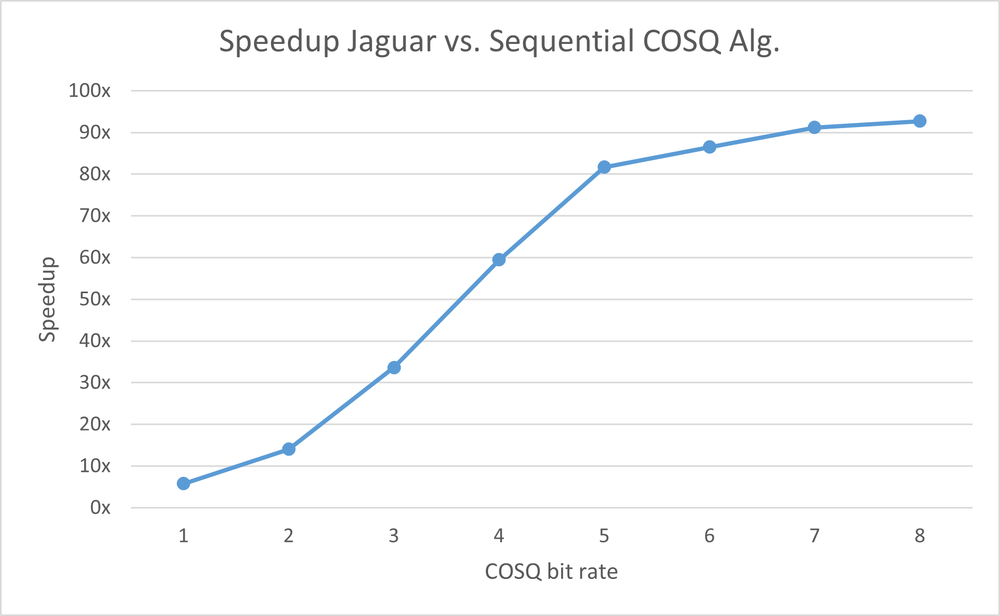

# Jaguar

Jaguar is a CUDA-accelerated Channel Optimized Scalar Quantizer (COSQ) generator. By passing it a file consisting of a series of doubles, Jaguar will generate near-optimal quantization points for the given sequence.

The command line arguments for jaguar are in the following format::

```bash
./jaguar -b "bit_rate" -t "training_length" -f "sequence_file"
```

Where

* **bit_rate** is the bit rate of the quantizer which jaguar will produce.
  The bit rate must be between 1 and 10 inclusive
* **training_length** is the length of the training sequence in the file.
  The length must be 2^20 to 2^25 inclusive, and must be a power of 2.
* **sequence_file** is the name of the file in the same directory of the exe,
  containing "training_length" number of doubles.

Please see [Getting Started](getting_started.md) for more details.

## Motivation

This project was inspired by MTHE 493 at Queen's University. During my final year in the Applied Mathematics and Engineering program, my team and I were tasked with creating an image transmission system which could maintain reasonable image fidelity. The main challenge for this project was generating COSQs for image transmission due to the very long latency.

Using Python I created a naive sequential implementation which generated COSQs. It worked fast enough for low bit rates and small training sizes, however became difficult to work with when using high bit rates and training sizes larger than 100,000.

* Low bit rates considered to be [1 .. 4] and high bit rates are [5 .. 10]
* Large training sizes are > 100,000

Even after writing the same implementation in C++, performance was still lacking at high bit rates
and larger training sizes. It was particularly frustrating since the team was under tight deadlines
and training an 8 bit quantizer with ~1,000,000 training elements took almost 2 hours.

After the course was over, I still wanted to investigate ways to speed up heavy computational workloads, which ultimately led to this project.

## Mathematical Model

Below is a very brief introduction into scalar quantization and channel modelling.

### Scalar Quantization

A scalar quantizer is simply a map $Q: \mathbb{R} \rightarrow C$. $C$ is referred to as the "codebook", or "quantization points" of the quantizer $Q$. The goal of scalar quantization is to represent a series of values by a discrete set of values.

The quantizer $Q$ also has regions $R_i$ called quantizer cells, defined as:

$$
    R_i=\{x:Q(x) = y_i\}, \qquad i = 1,…,N
$$

and $N$ is the number of quantization points.

It is clear that every element of the real numbers cannot be represented by a value of C without losing accuracy, so why would one do this? In the case of image transmission, this idea is very powerful because images can be very large files. To accomodate the transmission of such large files, which would have high latency, one can instead reduce the precision of the image by quantizing the image data, and send the quantized data rather than the raw image. Although the image sent will not be the same as the received image, the overall fidelity of the image will not have changed much, provided that the channel error rate is not high.

#### Distortion Measure

The error between the original value and its associated quantization point is called the distortion. By representing $x\in\mathbb{R}$ by $Q(x)=y_i \in C$, there is some error between the actual value and its representation by quantization. One popular distortion measure, which is used by Jaguar, is the squared error:

$$
    d(x,y)=(x-y)^2
$$

#### Rate

The rate of the scalar quantizer $Q$ is the number of bits used to encode the output of $Q$. Since the size of the output of $Q$ is simply $|C|=N$ it is easy to see that the rate $R(Q)$ is defined as

$$
    R(Q) = \log_{2}N
$$

The logarithm is base 2 because the quantization points will be represented in binary. If we were using ternary numbering, the logarithm would be base 3.

**Note:** In the source code, I typically use **levels** to denote the number of quantization levels, and **q_points** to denote the codebook.

#### Goal

The goal of optimizing scalar quantizers is to minimize the distortion for a given rate or a fixed $N=|C|$. In other words, given $Q_N$, the set of all scalar quantizer with $|C|=N$, an optimal scalar quantizer $Q^*$ is one such that,

$$
    D(Q^*)=\min_{Q\in Q_N}D(Q)
$$

### Channel

In addition to the error incurred from quantization, there is also error from sending data over a channel. The "channel", in the physical sense, is a medium in which electromagnetic signals are sent through to transmit a message. From the mathematical perspective, we only care about the likelyhood in which our message is transmitted without any distortion.

To "model" the probability that the message was received correctly or incorrectly, Jaguar uses the **Pólya Channel**. The Pólya Channel is an example of a channel with memory. Modeling a Pólya channel generally uses 2 main parameters, $\epsilon$ and $\delta$ as well as the size of the memory $M$. For simplicity, only consider channels with $M=1$. Since this is a channel with memory, it is helpful to look at the transition probabilities between an input block of $n$ bits $X=(X_1, \dots, X_n)$ and output block $Y=(Y_1, \dots, Y_n)$ rather than between bits. First define

$$
    g\left(e_i\right) := \begin{cases}
        \frac{(1-\epsilon)+(1-e_{i-1}\delta)}{1+\delta} & e_i = 0 \\
        \frac{\epsilon+e_{i-1}\delta}{1+\delta} & e_i = 1 \\
    \end{cases}, \qquad i = 2, \dots, n
$$

and

$$
    P(Z_i = e_i) = \begin{cases}
    1-\epsilon & e_i=0\\
    \epsilon & e_i=1
\end{cases}
$$

then use it to model

$$
    P(Y=y|X=x) = P(Z_1=x_1\oplus y_1)\prod^n_{i=2}g(x_i\oplus y_i)
$$

This channel is said to model the 'bursty' nature of noise in wireless channels, as when an error occurs it becomes more likely to occur in the next bit as well.

#### Splitting Technique

Before diving into the COSQ algorithm, one first needs an initial codebook. To generate the initial codebook, the "Splitting Technique" is used. This is described in "A study of vector quantization for noisy channels", pg. 806 B. Jaguar uses this algorithm to initialize the codebook.

#### COSQ Algorithm

The COSQ algorithm involves three main operations. This algorithm is very similar to the Lloyd-Max algorithm, except it has been modified to account for channel transmission errors.

##### Nearest Neighbour Condition (NNC)

Consider the case where there is a fixed codebook $C=\{y_1,...,y_N\}$, then the optimal (distortion minimizing) quantizer cells $\{R_1^*,...,R_N^*\}$ will satisfy:

$$
    R_i^* \subset \{ x: d(x,y_i) \leq d(x,y_j), \quad j=1,...,N\}, \qquad i=1,...,N
$$

The NNC says that every training element $x$ must belong to the quantizer cell for which the distortion between $x$ and the cell's quantization point $y_i$ is minimal.

In the case of Jaguar, since the channel must be acccounted for and it uses the squared error, the NNC becomes

$$
    R_i^* = \{ x: \sum_{j=1}^{N}p(j|i)(x - y_i)^2 \leq \sum_{j=1}^{N}p(j|i)(x - y_j)^2, \quad j=1,...,N\}, \qquad i=1,...,N
$$

Where $N$ is the number of quantization points, and p is the channel transition matrix.

##### Centroid Condition (CC)

Given the fixed quantizer cells $\{R_1,\dots,R_N\}$, the CC generates the codebook such that the quantizer has minimum distortion. The CC for MSE distortion gives output levels
$$
    y_j=\frac{\sum_{i=1}^{N}p(j|i)\sum_{x\in R_i}x}{\sum_{i=1}^{N}p(j|i)|R_i|}, \qquad j=1,\dots,N
$$
where $|R_i|$ is the number of training elements in the cell $R_i$.

##### Distortion

The average overall distortion (both from channel and quantization) can be computed as

$$
    D = \frac{1}{N}\sum_{t=1}^{n}\sum_{j=1}^{N}p(j|i(t))(x_t - y_j)^2
$$

where

* $N$ is the number of quantization points
* $n$ is the number of training sequence elements
* $p$ is the channel transition matrix
* $i(t)$ is the index of the quantizer cell for which training element belongs to

#### Algorithm

Putting all the above pieces together, the COSQ algorithm for Jaguar is as follows:

**Input:** bit rate $b$, training sequence $T$.

```c++
d_current = 0;
d_previous = DBL_MAX;
codebook = splitting_technique();
while(true) {
    NNC();
    CC();
    d_current = distortion();
    if((d_previous - d_current) / d_previous < THRESHOLD) {
      break;
    }
    d_previous = d_current;
}
```

## Repository Structure

* **docs** documentation for the project
* **measurements** execution times of jaguar and sequential impl for various bit rates.
* **test_kernels** smaller projects used to profile & test kernels used by Jaguar individually.
* **sequential** sequential COSQ algorithm implementation
* **src** source code for Jaguar
* **tests** test results (accuracy_test.sh) for various bit rates

## Development Environment

This project was developed on Windows 11 WSL 2.

Hardware

* Intel(R) Core(TM) i7-8700K CPU @ 3.70GHz (12 CPUs), ~3.7GHz
* NVIDIA GeForce RTX 2070
* 16384MB RAM

## Results

The result of this project is very positive. Jaguar provides significant speedup compared to the [sequential implementation written in C++](../sequential/). Please see the graphs below:




**Important!** These graphs were collected under the following parameters.

* Training size 1,048,576 (2^20).
* Splitting technique delta 0.001
* COSQ Threshold 0.01
* Pólya Channel parameters $\epsilon = 0, \delta = 0$

Although Jaguar performs very well in comparison, it can still be improved. Please see [Improvements & Future work](future_work.md).

### Remark

Because the project was done on WSL, these performance measurements are **NOT** 100% accurate. There were certainly some background processes on Windows stealing the CPU during these measurements, and the same is true for the GPU since it was rendering both monitors I have connected.

## Acknowledgements

I would like to all the people who have helped me with this project.

* Dr. Fady Alajaji for his mathematical guidance.
* Dr. Tamas Linder for supervising my capstone project.
* Dr. Ahmad Afsahi for his guidance on CUDA related resources.
* AmirHossein Sojoodi for providing project improvements.

## References

There are many notable resources that the project has used. Below is a full
list of all resources.

1. Wen-mei W. Hwu, David B. Kirk, Izzat El Hajj - Programming Massively Parallel Processors. A Hands-on Approach-Elsevier (2023)
2. Nariman Farvardin - A Study of Vector Quantization
for Noisy Channels
3. Kiraseya Preusser - Channel Optimized Scalar Quantization over
Orthogonal Multiple Access Channels with Memory
4. Optimizing Parallel Reduction in CUDA - Mark Harris
5. An Algorithm for Vector Quantizer Design - Yoseph Linde, Andres Buzo, Robert M. Gray
6. Channel Optimized Quantization of Images over Binary Channels with Memory - Julian Cheng
7. Using Simulated Annealing to Design Good Codes - Abbas A. El Gamal, Lane A. Hemachandra, Itzhak Shperling, Victor K. Wei
